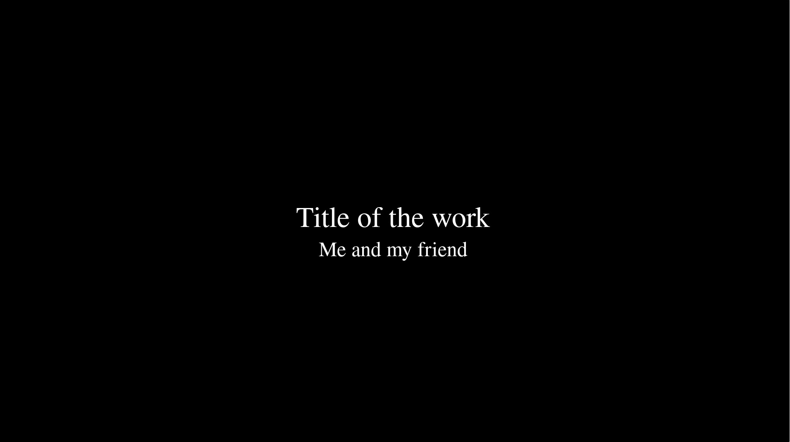

# Commlab Video Compilation

The script is used to compile video works from students in Communications Lab at NYU Shanghai. The program concatenates all the `.mp4` videos in the `/media` folder while adding a title card at the beginning of each.

## Installation

Run `pip install -r requirement.txt` to install [MoviePy](https://zulko.github.io/moviepy/index.html). In order to process the text generation, you also need to install [ImageMagick](https://www.imagemagick.org/script/index.php) and the installation detail can be found [here](https://zulko.github.io/moviepy/install.html#other-optional-but-useful-dependencies).

## How it works

The program fetches the title and authorship information from the file names of the videos in `/media`, expecting the two strings separated with `_`, like such

```
Title of the work_Me and my friends.mp4
```

The default title card looks like this:


## Usage

If it's not straightforward enough, after all the video files is in `/media` folder, run the program with

```
python main.py
```

If you are not happy with the result, feel free to tweak some of the exposed variables related to the text styles.
